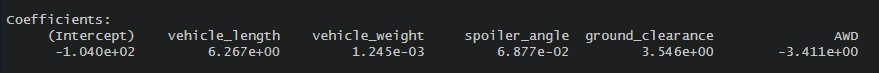
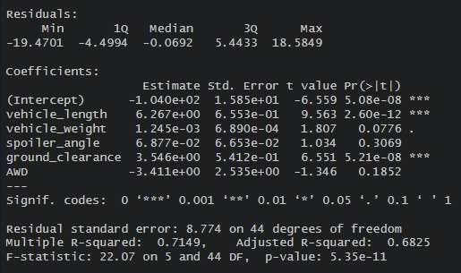
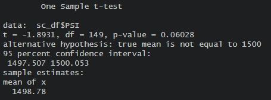
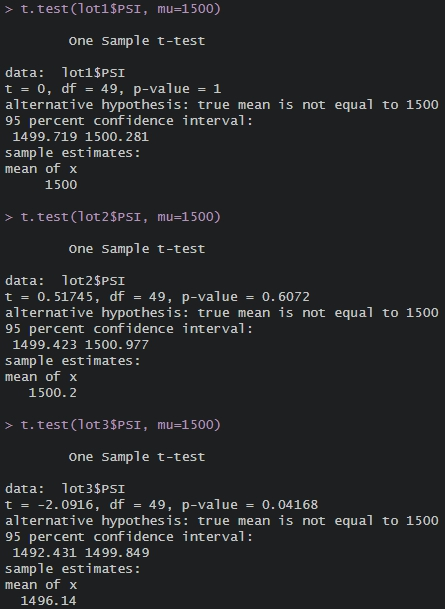

# MechaCar Statistical Analysis

## Linear Regression to Predict MPG
  

 

From Pr(|t|) values, we can asess that vehicle_length and ground_clearance serves as non-random metrics to mpg with each values closer to 0 than others. 

The slope of our linear regression model is not 0. This can be determined by looking at p-value, which is 5.35e-11, meaning there is enough evidence to reject null hypothesis, thus ensuring the linear model is not 0.

This linear model predicts mpf of MechaCar effectively with 71.5% accuracy, referring to the R-squared value in the summary image. 

## Summary Statistics on Suspension Coils
   
  

With design specifictaion indicating the suspension coils not to exceed 100 pounds per square inch, the susepsnsion coils meet the specification in total, but not in individual lots. The total summary in first image shows there is variance of 62.29, less than 100; however, individual lot shows that lot 1&2 has very little variance, but lot 3 has variance of 170, exceeding the specification by more than 70 lbs.

## T-Tests on Suspension Coils
   
  

The total t-test as well lot 1&2's t-tests resulted with p-value higher than 0.05, a common significance level. This suggests that there isn't a sufficient evidence to reject the null hypothesis. However, lot 3's p-value of less than 0.5 suggests there is enough evidence to reject the null hypothesis - there is statistical difference between observed sample mean and the presumed mean of 1500.

## Study Design: MechaCar vs Competition
A couple good metrics to test to determine whether MechaCar will perform better than its competitor are fuel efficiency and horsepower. These two metrics are what general consumers look at before purchasing a car, particularly fuel efficiency. Better fuel efficiency coupled with high horsepower will appeal very well to consumers and critics. 

A possible null hypothesis will be 'If highway fuel efficiency of MechaCar is less than the average highway fuel efficiency of competitors, MechaCar will not perform better than other competitors.' To test the hypothesis, t-test can be utilized to see if there is enough evidence to reject the null hypothesis or not. To run this test though, highway fuel efficiency data of the competitors needs to be obtained prior. 
